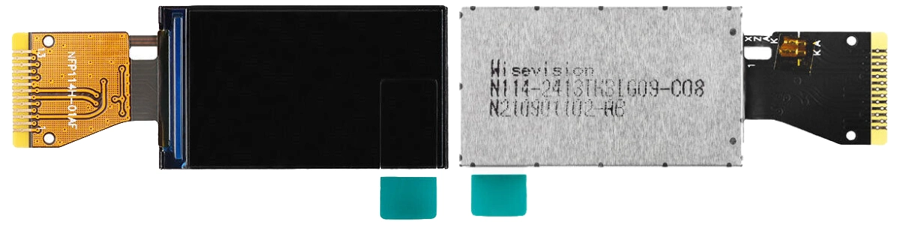

# CH32V003 ST7789 Driver

A minimal ST7789 LCD driver for CH32V003 that supports both [ch32v003fun](https://github.com/cnlohr/ch32v003fun) and [PlatformIO CH32V](https://github.com/Community-PIO-CH32V/platform-ch32v). It should also work in [MounRiver Studio](http://www.mounriver.com/).

DMA is used to accelerate the data transmission where possible.

<!--  -->

- [CH32V003 ST7789 Driver](#ch32v003-st7789-driver)
  - [Usage](#usage)
    - [Wiring](#wiring)
    - [Initialization](#initialization)
    - [Text](#text)
    - [Drawing](#drawing)
  - [Configuration](#configuration)
    - [Change Resolution and Offset](#change-resolution-and-offset)
    - [RGB Color Macro](#rgb-color-macro)
    - [Set Rotation and RGB Ordering](#set-rotation-and-rgb-ordering)
    - [Invert Colors](#invert-colors)
  - [CH32V003 Development Guide](#ch32v003-development-guide)
  - [References](#references)
  - [License](#license)

## Usage

### Wiring

ST7789 13-pin module



| CH32V003         | ST7789      | Power | Description                             |
| ---------------- | ----------- | ----- | --------------------------------------- |
|                  | 1 - `NC`    |       |                                         |
|                  | 2 - `NC`    |       |                                         |
| `PC6` (SPI MOSI) | 3 - `SDA`   |       | SPI MOSI (Master Output Slave In)       |
| `PC5` (SPI SCLK) | 4 - `SCL`   |       | SPI SCLK (Serial Clock)                 |
| `PC4`            | 5 - `RS`    |       | DC (Data / Command)                     |
| `PC3`            | 6 - `RESET` |       | Reset                                   |
| `PC2`            | 7 - `CS`    |       | SPI CS/SS (Chip/Slave Select)           |
|                  | 8 - `GND`   | `GND` |                                         |
|                  | 9 - `NC`    |       |                                         |
|                  | 10 - `VDD`  | `3V3` |                                         |
|                  | 11 - `LEDK` |       | Connect to `GND` via a 15-100Ω resistor |
|                  | 12 - `LEDA` | `3V3` |                                         |
|                  | 13 - `GND`  | `GND` |                                         |

Note: To not use CS, define the `ST7789_NO_CS` macro in `ST7789.h`. Make ST7789 always enabled by pulling CS to ground.

```C
#define ST7789_NO_CS
```

### Initialization

Include the header file.

```C
#include "ST7789.h"
```

Then invoke `tft_init()` function to initialize the driver.

```C
tft_init();
```

### Text

Print a string.

```C
tft_set_color(RED);
tft_set_background_color(BLACK);
tft_set_cursor(2, 2);
tft_print("Hello World!");
```

Print integers.

```C
tft_set_color(RED);
tft_set_background_color(BLACK);
tft_set_cursor(2, 10);
tft_print_number(123, 0);   // Align left as the width is less thant the number.
tft_set_cursor(2, 20);
tft_print_number(-123, 30); // Align right as the width is greater than the number.
```

### Drawing

Draw a pixel.

```C
tft_draw_pixel(80, 30, RED);
```

Draw a line.

```C
tft_draw_line(10, 10, 30, 30, BLUE);
```

Draw a rectangle.

```C
tft_draw_rect(10, 10, 30, 30, BLUE);
```

Fill a rectangle area.

```C
tft_fill_rect(10, 10, 30, 30, BLUE);
```

## Configuration

Depends on which ST7789 variants you have, it may require different configurations. You can configure the behavior in `ST7789.h` or `ST7789.c`.

### Change Resolution and Offset

```C
// ST7789.h
#define ST7789_WIDTH    240
#define ST7789_HEIGHT   135
#define ST7789_X_OFFSET 40
#define ST7789_Y_OFFSET 53
```

### RGB Color Macro

```C
// ST7789.h
#define RGB565(r, g, b) ((((r)&0xF8) << 8) | (((g)&0xFC) << 3) | ((b) >> 3))
#define BGR565(r, g, b) ((((b)&0xF8) << 8) | (((g)&0xFC) << 3) | ((r) >> 3))
#define RGB             RGB565
```

### Set Rotation and RGB Ordering

```C
// ST7789.c
void tft_init(void)
{
    ...
    // Set rotation
    // Set rotation
    write_command_8(ST7789_MADCTL);
    // write_data_8(ST7789_MADCTL_MY | ST7789_MADCTL_MV | ST7789_MADCTL_RGB);  // 0 - Horizontal
    // write_data_8(ST7789_MADCTL_RGB);                                        // 1 - Vertical
    write_data_8(ST7789_MADCTL_MX | ST7789_MADCTL_MV | ST7789_MADCTL_RGB);  // 2 - Horizontal
    // write_data_8(ST7789_MADCTL_MX | ST7789_MADCTL_MY | ST7789_MADCTL_RGB);  // 3 - Vertical
    ...
}
```

### Invert Colors

```C
// ST7789.c
void tft_init(void)
{
    ...
    // Invert display
    write_command_8(ST7789_INVON);
    // write_command_8(ST7789_INVOFF);
    ...
}
```

## CH32V003 Development Guide

[CH32V003 Development Guide](CH32V003_Dev_Guide.md)

## References

- [moononournation: Arduino_GFX](https://github.com/moononournation/Arduino_GFX)
- [ST7789 Datasheet](docs/ST7789VW.pdf)
- [E. Brombaugh: SPI OLED demonstration](https://github.com/cnlohr/ch32v003fun/tree/master/examples/spi_oled)

## License


This work is licensed under a [Creative Commons Attribution-NonCommercial-ShareAlike 4.0 International License (CC BY-NC-SA 4.0)](https://creativecommons.org/licenses/by-nc-sa/4.0/).

- Attribution - You must give appropriate credit, provide a link to the license, and indicate if changes were made. You may do so in any reasonable manner, but not in any way that suggests the licensor endorses you or your use.
- NonCommercial - You may not use the material for commercial purposes.
- ShareAlike - If you remix, transform, or build upon the material, you must distribute your contributions under the same license as the original.
